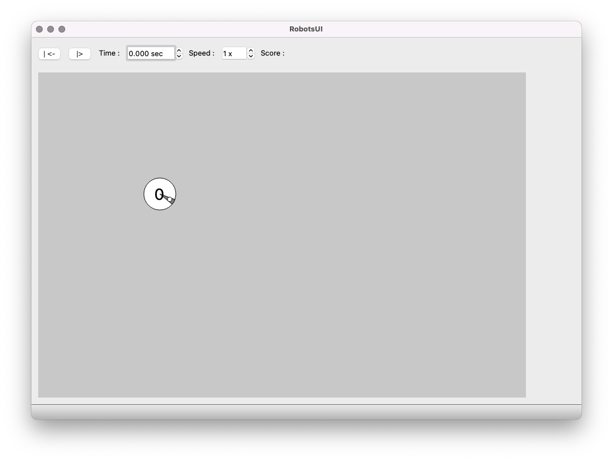

# State

L'état courant du monde constitué de [particules](../Particule) et de [robots](../Robot
) et est représenté via la structure suivante.

~~~cpp 
struct State {
   double time;
   Position worldOrigin;
   Position worldEnd;
   std::vector<RobotInfo> robots;
   std::vector<ParticleInfo> particles;
};
~~~

`time` contient le temps courant. Il vaut `0` au début de la simulation, puis augmente.

`worldOrigin` et `worldEnd` contiennent les coordonnées des extrémités du monde visible 
qui devra être affiché. `worldOrigin` est en haut à gauche et `worldEnd` en bas à droite. 

Les [Robots](../Robot) et les [Particules](../Particule) présentes au temps `time` sont 
stockées dans des `std::vector`. 

Quelques exemples d'états aux format [JSON](../JSON) et leurs représentations graphiques:

| JSON                                | Représentation       |
|-------------------------------------|----------------------|
| [robotDemo.stat](./data/robotDemo.stat)       |  |
| [particleDemo.stat](./data/particleDemo.stat) |  |
| [1r4p.stat](./data/1r4p.stat)                 |  |
| [4r4p.stat](./data/4r4p.stat)       |  |
